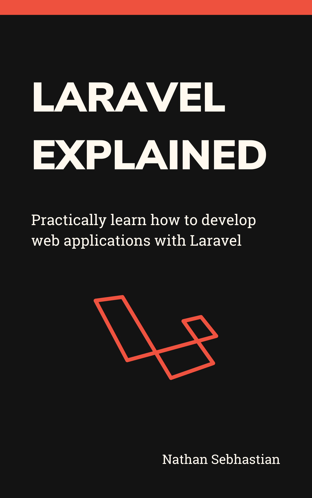

= Digesting React: Learn React without racking your brains
:author: Nathan Sebhastian
:email: nathan@sebhastian.com
:revnumber: 1.0
:revdate: January 1st, 2021
:doctype: book
:toc:
:icons: font
:data-uri:
:lang: en
:source-highlighter: rouge
:rouge-style: igorpro
:pdf-theme: pdf-theme.yml
:front-cover-image: 

[preface]
include::chapters/about.adoc[]

include::chapters/preface.adoc[]

== Introduction

include::chapters/introduction.adoc[]

== First Part

include::chapters/chapter2.adoc[]

== Second Part

include::chapters/chapter3.adoc[]

[colophon]
include::chapters/colophon.adoc[]

include::chapters/bibliography.adoc[]

[appendix]
include::chapters/appendix.adoc[]

ifdef::backend-docbook[]
[index]
Index
-----
endif::backend-docbook[]

